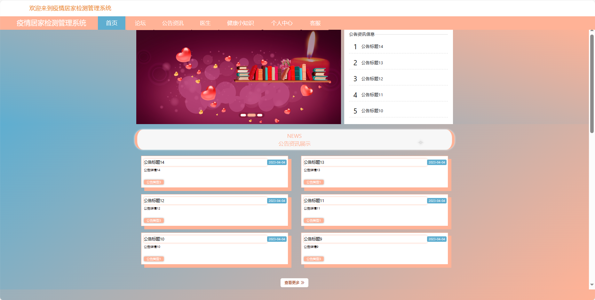
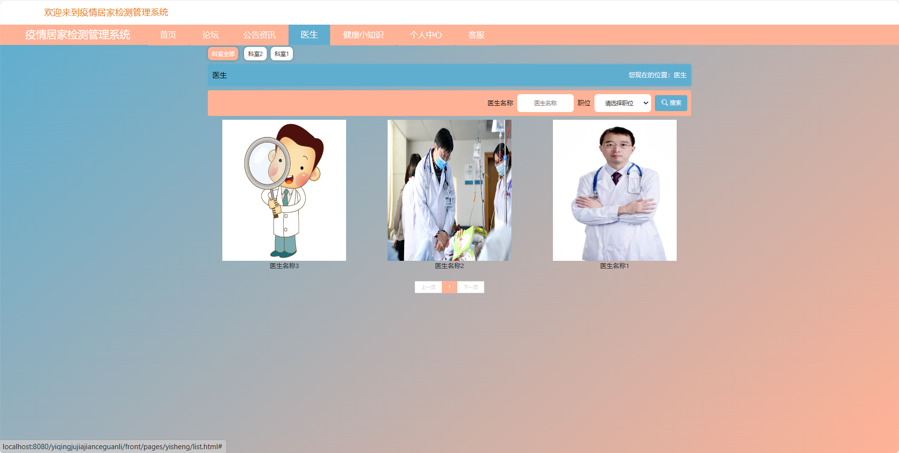
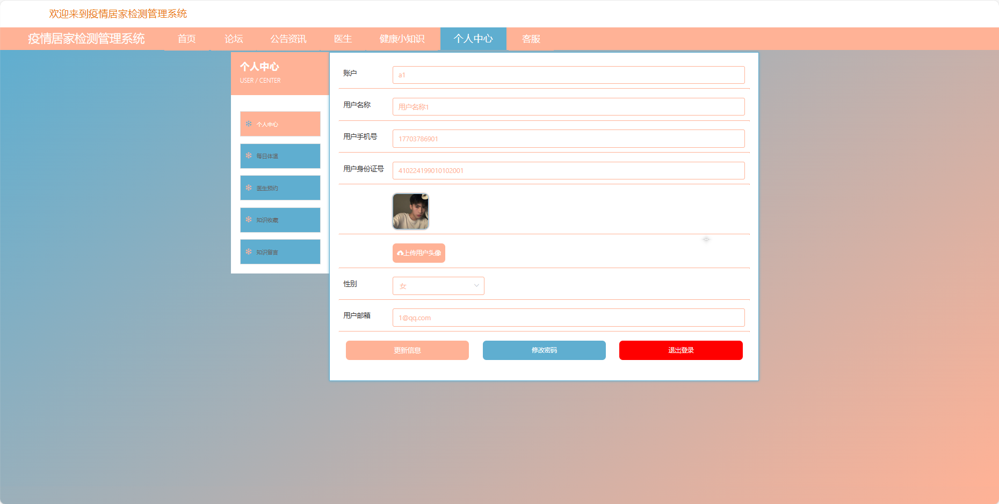
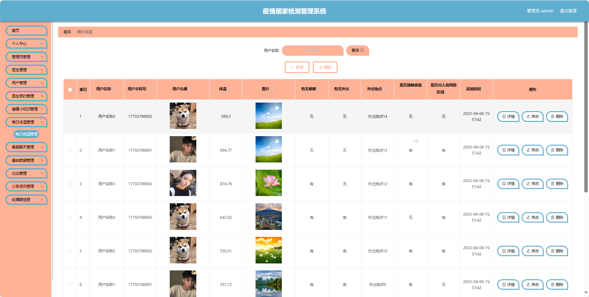
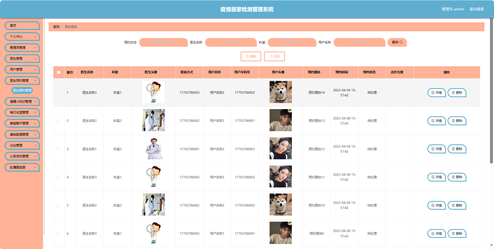
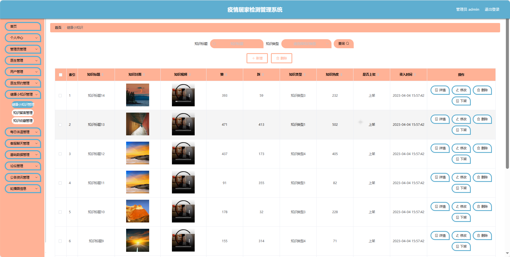
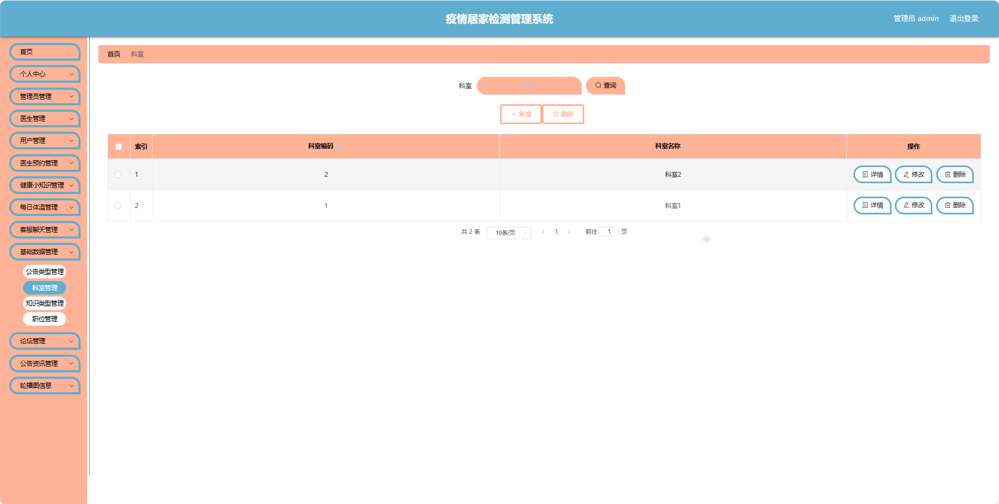

## 基于SpringBoot的疫情居家检测管理系统

###  获取sql数据库文件: 从戎源码网 (https://armycodes.com/) QQ: 386869957 QQ群: 377586148
###  所有系统地址: (https://github.com/YuLin-Coder/AllProjectCatalog) 
###  所有项目以及源代码本人均调试运行无问题 可支持远程安装部署调试、定制修改、代码讲解

## 项目介绍
基于SpringBoot的疫情居家检测管理系统，系统包含三种角色：管理员、用户、医生，主要功能如下。

【用户功能】
1. 首页：获取系统信息。
2. 论坛：参与居民讨论和分享信息。
3. 公告：查看社区发布的各类公告。
4. 医保信息：了解医疗保障相关信息。
5. 个人中心：管理个人信息，查看预约和就诊历史。

【管理员功能】
1. 首页：查看系统整体。
2. 个人中心：管理管理员的个人信息。
3. 管理员管理：维护系统管理员的账户信息。
4. 医生管理：添加、编辑和删除医生信息。
5. 用户管理：查看和管理系统用户的信息。
6. 预约管理：审核和管理用户对医生的预约服务。
7. 就诊历史管理：查看和管理用户的就诊历史记录。
8. 健康信息管理：记录和查看用户的健康信息。
9. 药品管理：管理系统内的药品种类。
10. 药品入库管理：记录和管理药品的入库情况。
11. 药品使用管理：记录和管理药品的使用情况。
12. 医保信息管理：管理医保相关信息。
13. 论坛管理：审核和回复用户在论坛上的帖子。
14. 公告管理：发布、编辑和管理公告信息。
15. 基础数据管理：管理系统的基础数据。
16. 轮播图信息：管理系统首页的轮播图展示。

【医生功能】
1. 首页：查看医生个人信息。
2. 个人中心：管理医生的个人信息。
3. 预约管理：查看和管理用户对医生的预约服务。
4. 就诊历史管理：查看和管理用户的就诊历史记录。
5. 健康信息管理：记录和查看用户的健康信息。
6. 药品管理：管理系统内的药品种类。
7. 药品入库管理：记录和管理药品的入库情况。
8. 药品使用管理：记录和管理药品的使用情况。
9. 医保信息管理：管理医保相关信息。
10. 论坛管理：审核和回复用户在论坛上的帖子。
11. 公告管理：发布、编辑和管理公告信息。
12. 轮播图信息：管理系统首页的轮播图展示。

## 项目技术
- 编程语言：Java
- 数据库：MySQL
- 项目管理工具：Maven
- 前端技术：HTML、CSS、JavaScript、Jquery、Vue
- 后端技术：Spring、SpringMVC、MyBatis

## 运行环境
- JDK版本：JDK1.8及以上
- 开发工具：IDEA、Ecplise、Myecplise都可以
- 数据库: MySQL5.7及以上
- Maven：maven3.0及以上
- Node：14.14.0及以上

## 运行截图

